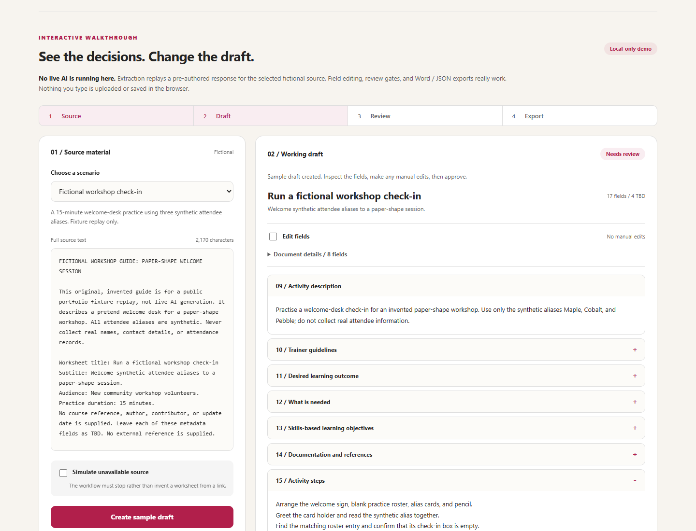

# Practice Lab Studio

**From workshop guides to practical activity worksheets, with a human in control.**

[Try the live demo](https://hernanacostaa.github.io/practice-lab-studio/) · [Product case study](docs/CASE_STUDY.md) · [Architecture](docs/ARCHITECTURE.md) · [Build it in Power Platform](docs/DEPLOYMENT.md)



## The problem

A useful workshop guide is not automatically a useful practice exercise. Facilitators still have to identify the audience, outcomes, materials, activity outline, and validation criteria, then assemble a consistent document. An unrestricted chat assistant can miss requirements, invent missing facts, or jump straight to a finished artifact.

Practice Lab Studio turns that process into a controlled workflow:

**Source text → 17-field draft → human review and revisions → Word document**

This independent portfolio project by **Hernan Acosta** demonstrates product framing, prompt and data-contract design, low-code orchestration, failure handling, and document delivery. All public scenarios and assets were newly authored for this project.

## Try it in two minutes

1. [Open the demo](https://hernanacostaa.github.io/practice-lab-studio/) and choose a fictional scenario.
2. Select **Create sample draft**. Open the worksheet fields to inspect the content.
3. Turn on **Edit fields**, change a field, and select **Apply field**.
4. Review and approve the worksheet, then download **Word** or **JSON**.

Try **Simulate unavailable source** to see the workflow stop instead of manufacturing a document from a failed retrieval.

**Demo disclosure:** extraction is a replay of pre-authored sample responses, not a live AI call. Editing, validation, approval gates, and document exports are functional. There is no sign-in, API key, cloud connection, telemetry, browser storage, or upload of field contents. Use fictional material only.

## What is real, and what is a blueprint?

| Component | Included | Status |
|---|---|---|
| Browser walkthrough | Three fictional sources and their illustrative 17-field drafts | Runs locally or on GitHub Pages |
| Review workflow | Manual edits, explicit missing facts, reapproval after changes | Implemented |
| Document export | Editable `.docx` and exact-schema `.json` downloads | Implemented locally |
| Prompt contracts | ExtractPA, EditPA, FormatPreview, GeneratePA | Reusable text; configure in your own environment |
| Controlled topic and delivery flow | Source gates, review loop, error paths, replaceable connections | Descriptive blueprints, **not importable solution exports** |
| Copilot Studio + Power Automate deployment | Instructions and original sample template | Optional; **not deployed by this repository** |
| Business impact | Measurement plan and acceptance criteria | No claimed time savings, adoption, or production scale |

The public browser layer is a demonstration adapter. The reusable platform design preserves the same four prompt responsibilities and deterministic source-to-document sequence; it does not require the browser application in the platform runtime.

## Design decisions worth exploring

- **A link is not source content.** Retrieval must produce actual text before extraction can proceed.
- **One field contract.** All 17 fields are strings, and the same keys survive extraction, edits, preview, and export.
- **Unknown stays unknown.** Missing facts remain `TBD`; sample objectives are supported by the sample tasks.
- **Review has meaning.** Pending edits block export, and applied changes invalidate prior approval.
- **Formatting is not generation.** Document assembly places the reviewed content without adding technical claims.
- **Cloud dependencies are optional.** Public examples do not require an organization's tenant, documents, or connectors.

Read the [case study](docs/CASE_STUDY.md) for the problem, tradeoffs, evidence, and measurement plan, and the [architecture](docs/ARCHITECTURE.md) for the two distinct runtime paths.

## Run locally

Requires **Node.js 22 or newer** and npm.

```sh
npm ci
npm run build
npm run dev
```

Open `http://127.0.0.1:4173`. The generated `dist/index.html` is also a self-contained file that can be opened directly, including Word export, without a server or network connection. Rebuild after changing source files.

```sh
npm test
npm run check:public
npx playwright install chromium
npm run test:e2e
```

`npm run verify` combines domain/document tests, the production build, and a public-release pattern check. Browser tests separately cover the review workflow, all scenarios, source failures, safe text rendering, downloads, and responsive layouts. The automated checks complement, but do not replace, content and provenance review.

## Repository map

| Path | Purpose |
|---|---|
| `src/core.mjs` | Worksheet contract and deterministic demo domain logic |
| `src/samples.mjs` | Newly authored fictional sources and illustrative responses |
| `src/app.mjs` | Browser state, review, editing, and local downloads |
| `src/document.mjs` | Original Word document layout |
| `schemas/worksheet.schema.json` | Exact 17-field JSON contract |
| `samples/` | Source text, example JSON, generated Word examples, and a blank template |
| `platform/` | Sanitized prompt and workflow blueprints |
| `docs/` | Product case study, architecture, deployment, and release boundaries |
| `tests/` | Domain, document, and browser tests |
| `.github/workflows/` | Verification and GitHub Pages deployment |

To regenerate the Word examples and template from the public fixtures:

```sh
node scripts/make-examples.mjs
```

Optional package/XML verification of all four generated documents uses Python 3 and no additional packages: `python scripts/validate-documents.py`.

## Boundaries

This is an independent, fictionalized portfolio adaptation, not an official Microsoft product or an endorsement. It contains no original organizational source documents, screenshots, recordings, solution exports, connection bindings, or inherited Git history. It makes no claim that replacing names alone makes proprietary material publishable.

The optional cloud build needs your own eligible Power Platform environment and approved connections. Do not add credentials or private source material to this repository. See [public-release boundaries](docs/PUBLIC_RELEASE.md) and [third-party notices](THIRD_PARTY_NOTICES.md).

## License

Original public project code, documentation, and fictional examples are provided under the [MIT License](LICENSE). Third-party libraries retain their own licenses. Microsoft product names identify optional integration technologies; no Microsoft templates, branding, or organizational procedures are included.
